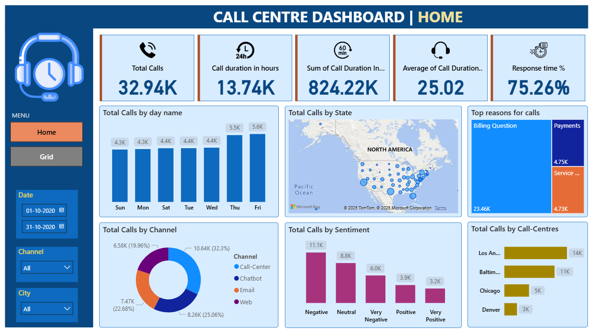

# 📞 Call Centre Performance Dashboard – Power BI

A professional **Power BI Dashboard** analyzing call-centre performance across states, channels, sentiment, and time.
This report provides actionable insights to improve **service efficiency**, **customer satisfaction**, and **agent effectiveness**.

---

## 🎯 Project Overview

Call centres handle hundreds of calls daily. This dashboard monitors operational efficiency and customer experience, helping identify:

✅ Total call volume & day-wise trends
✅ Call duration & average call time
✅ Call channel usage (Phone / Chat / Email / Web)
✅ Response rate & service performance
✅ Customer sentiment distribution
✅ State-wise call patterns
✅ Top reasons for calls
✅ City-wise call-center performance

---

## 📸 Dashboard Preview

---

## 📊 Key Metrics (KPIs)

| KPI                                   | Description                 |
| ------------------------------------- | --------------------------- |
| 📞 **Total Calls**                    | 32.94K calls handled        |
| ⏳ **Call Duration (Hours)**           | 13.74K hours spent on calls |
| 🕑 **Sum of Call Duration (Minutes)** | 824.22K minutes             |
| ⏱ **Average Call Duration**           | 25.02 minutes per call      |
| ⚡ **Response Time %**                 | 75.26%                      |

---

## 📈 Visual Insights

| Insight Panel                      | Details                                              |
| ---------------------------------- | ---------------------------------------------------- |
| 📅 **Calls by Day**                | Highest on Thu/Fri (5.5K+)                           |
| 🗺️ **Calls by State**             | US map with state-wise volume                        |
| 📦 **Top Call Reasons**            | Billing, Payments, Service related queries dominate  |
| 🎧 **Calls by Channel**            | Phone = highest usage, followed by Email, Web & Chat |
| 😊 **Customer Sentiment**          | Majority **Negative**, followed by Neutral           |
| 🏢 **Calls by Call-Centre (City)** | LA (14K) highest, Baltimore & Chicago follow         |

---

## 📂 Dataset

| Detail     | Value                                             |
| ---------- | ------------------------------------------------- |
| Source     | Call Centre Generated Dataset (CSV)               |
| Files Used | `Call Center_Call Center.csv`, `Call Centre.pbix` |
| Tool       | Power BI Desktop                                  |

Filters Used

* 📅 Date Range
* 📡 Channel
* 🏙️ City

---

## 🧼 Data Preparation

✔ Cleaned and formatted date/time columns
✔ Standardized sentiment & channel categories
✔ Created calculated duration columns
✔ Built relationships for time, state & channel analysis

---

## 🧾 Insights

* 📈 **Call volume peaks Thu–Fri**
* 🏙️ **LA call-centre handles the highest calls**
* 💬 **Phone remains primary communication channel**
* 😕 **Negative sentiment highest → improvement needed**
* 💳 **Billing & Payment queries most common**

---

## 🚀 Future Enhancements

* Predictive call volume forecast (ML models)
* Real-time dashboard with API data
* Agent performance scoring system
* Sentiment analysis using transcripts

---

## 👤 Author

**Mangal Singh**

🌐 GitHub: [https://github.com/mangal-singh001](https://github.com/mangal-singh001)
🔗 LinkedIn: [https://www.linkedin.com/in/mangal-singh123/](https://www.linkedin.com/in/mangal-singh123/)

---

## ⭐ Support

If you found this useful, please give the repo a **⭐ star** to support!

---
